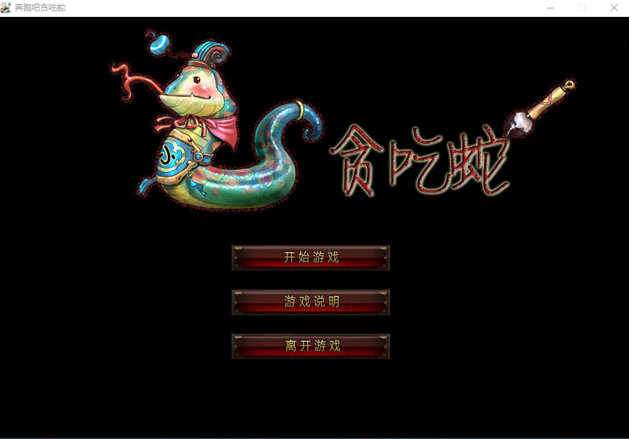
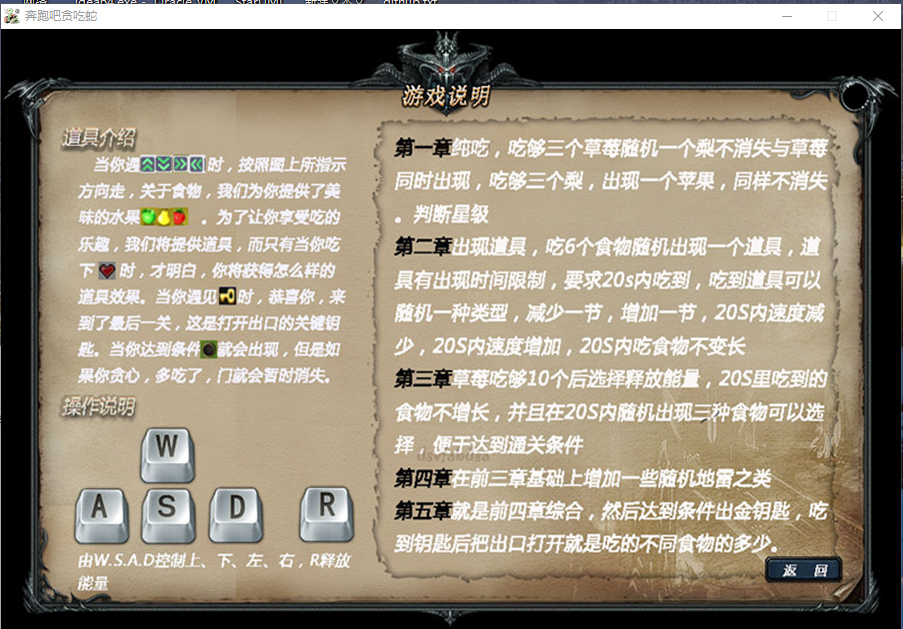
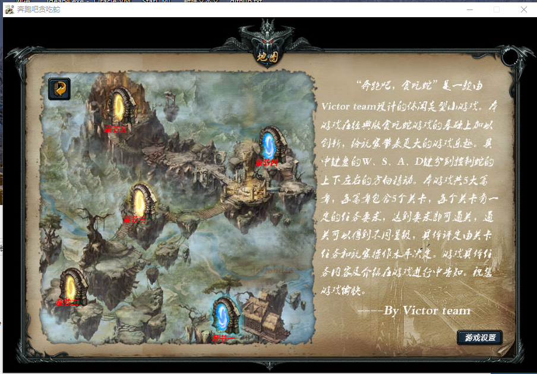
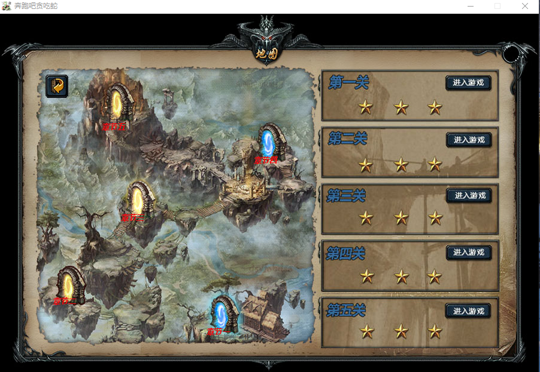
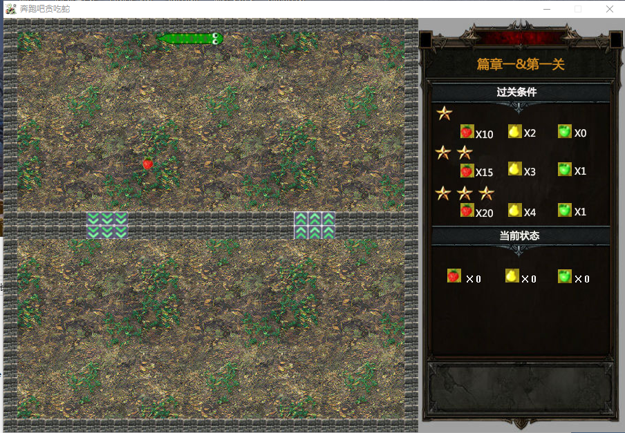

# 《奔跑吧，贪吃蛇》
## 游戏简介

----------欢迎来到‘奔跑吧！贪吃蛇’！----------

此游戏由Victors团队精心打造，只为给你带来不一样的贪吃蛇体验。重温童年快乐的同时，你可以感受到其他贪吃蛇游戏感受不到的炫酷体验。游戏的规则请点击游戏中的相应选项查看。

惊天小秘密：

如果想直接体验后面几章的精彩游戏，可以将root文件夹中的star.txt文件覆盖游戏主目录下的star.txt文件。重启游戏，你便可以立即体验全章节，无比炫酷的‘奔跑吧！贪吃蛇’！但是，Victors还是建议大家从第一关开始呦，在闯关中你会体验不一样的通关快感！还等什么！快去通关吧！

在此，Victors团队祝您游戏愉快！劳逸结合！(*^__^*)

------by 郭欣光

## 团队介绍
《奔跑吧，贪吃蛇》由Victors团队开发于2016年3月--2016年5月，获得长春工业大学校C语言程序设计大赛第一名。团队成员：汤佳辉、郭欣光、赵鹏越、谭展航。
## 游戏图片
游戏部分图片如下（也可在游戏界面目录中查看）：
- 游戏主页面

- 游戏说明

- 游戏章节

- 游戏选关

- 游戏界面

